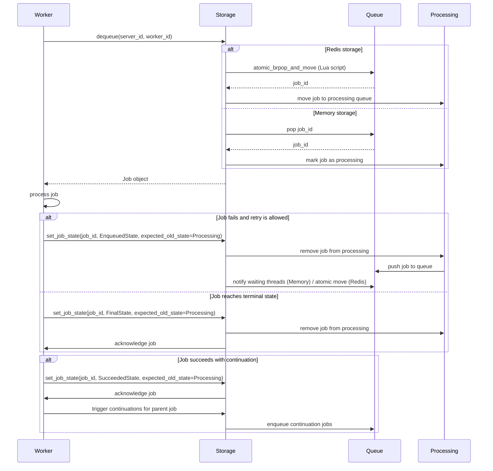

# PyTaskFlow - Background jobs and workers for Python

PyTaskFlow is an ambitious and exciting project! Heavily inspired by `Hangfire` - a popular dotnet package for background jobs and workers.

The Python package is still WIP (work in progress) and requires careful thought about Python's ecosystem, concurrency models, and common practices. Let's break down the comprehensive plan to build a solid foundation for the project.


## Core Concepts & Philosophy (Inspired by Hangfire)

**I. Core Concepts & Philosophy (Inspired by Hangfire)**

1.  **Job:** A unit of work to be executed in the background. This will be a Python function or method.
2.  **Storage:** A persistent backend to store job definitions, states, queues, and statistics (e.g., Redis, PostgreSQL, MongoDB, InMemory for testing).
3.  **Client:** An interface to create background jobs (fire-and-forget, delayed, recurring, continuations).
4.  **Server/Worker:** A process (or set of processes/threads) that fetches jobs from storage queues and executes them.
5.  **Dashboard:** A web UI to monitor jobs, queues, workers, and perform basic operations.
6.  **States:** Jobs transition through states (Enqueued, Scheduled, Processing, Succeeded, Failed, Deleted, Awaiting).
7.  **Queues:** Jobs are placed into named queues, allowing workers to specialize.
8.  **Extensibility:** Filters (for job creation/execution lifecycle), custom state handlers.
9.  **Reliability:** Automatic retries for failed jobs.
10. **Concurrency:** Support for both threaded and asynchronous (asyncio) job execution, and potentially multiprocessing for CPU-bound tasks.

**II. Project Structure (Monorepo-like or separate packages later)**

```
pytaskflow/
├── pytaskflow/                  # Core library code
│   ├── __init__.py            # Public API (enqueue, schedule, etc.)
│   ├── client.py              # BackgroundJobClient
│   ├── common/                # Shared utilities, Job class, enums
│   │   ├── __init__.py
│   │   ├── job.py             # Job data model
│   │   ├── states.py          # State definitions (enum or classes)
│   │   ├── exceptions.py
│   │   └── utils.py
│   ├── config.py              # Global configuration
│   ├── decorators.py          # @background_job decorator
│   ├── execution/             # Job execution logic
│   │   ├── __init__.py
│   │   ├── performer.py       # Executes the actual job function
│   │   └── context.py         # PerformContext
│   ├── filters/               # Job filters
│   │   ├── __init__.py
│   │   ├── base.py            # IJobFilter equivalent
│   │   └── builtin.py         # RetryAttribute, etc.
│   ├── scheduling/            # For delayed and recurring jobs
│   │   ├── __init__.py
│   │   ├── cron.py            # CRON parsing/utilities
│   │   ├── delayed.py
│   │   └── recurring.py
│   ├── serialization/         # Job (de)serialization
│   │   ├── __init__.py
│   │   ├── base.py
│   │   └── json_serializer.py # Default serializer
│   ├── server/                # Worker logic
│   │   ├── __init__.py
│   │   ├── worker.py          # Worker class
│   │   └── processor.py       # Processes a single job
│   ├── storage/               # Storage backends
│   │   ├── __init__.py
│   │   ├── base.py            # JobStorage ABC
│   │   ├── redis_storage.py
│   │   ├── sql_storage.py     # Potentially using SQLAlchemy
│   │   └── memory_storage.py
│   └── dashboard/             # Optional: Web UI components
│       ├── __init__.py
│       ├── app.py             # FastAPI/Starlette/Flask app
│       ├── routes.py
│       ├── static/
│       └── templates/
├── integrations/              # Framework-specific integrations
│   ├── pytaskflow_fastapi/
│   │   ├── __init__.py
│   │   └── plugin.py
│   ├── pytaskflow_litestar/
│   │   ├── __init__.py
│   │   └── plugin.py
│   └── pytaskflow_script/     # Helpers for CLI/script usage
│       ├── __init__.py
│       └── runner.py
├── examples/
├── tests/
├── docs/
├── pyproject.toml
├── README.md
└── ...
```

**III. Core Component Design & Architecture**

1.  **`pytaskflow.common.job.Job` Data Model:**
    *   `id`: Unique job ID (UUID).
    *   `created_at`: Timestamp.
    *   `target_module`: String (e.g., `my_app.tasks`).
    *   `target_function`: String (e.g., `send_email`).
    *   `args`: Tuple of serialized arguments.
    *   `kwargs`: Dict of serialized keyword arguments.
    *   `state_name`: Current state (e.g., `EnqueuedState.NAME`).
    *   `state_data`: Dict with state-specific data (e.g., exception for `FailedState`).
    *   `queue`: Target queue name.
    *   `retry_count`: Current retry attempt.
    *   `scheduled_at`: For delayed/recurring jobs.
    *   `recurring_job_id`: For instances of recurring jobs.

**Job Processing Flow:**

The following diagram illustrates how jobs flow through the system from dequeue to completion:



2.  **`pytaskflow.serialization`:**
    *   **Base Serializer (`BaseSerializer` ABC):**
        *   `serialize_job(job: Job) -> str`
        *   `deserialize_job(data: str) -> Job`
        *   `serialize_args(*args, **kwargs) -> Tuple[str, str]` (args_str, kwargs_str)
        *   `deserialize_args(args_str: str, kwargs_str: str) -> Tuple[tuple, dict]`
    *   **JSON Serializer (`JsonSerializer`):**
        *   Uses `json` module.
        *   Handles common types. For complex types, users might need custom (de)serialization logic or use libraries like Pydantic.
        *   Function references will be by `module_name.function_name`.

3.  **`pytaskflow.storage.base.JobStorage` (Abstract Base Class):**
    *   `enqueue(job: Job) -> str`: Adds job to storage in Enqueued state.
    *   `schedule(job: Job, enqueue_at: datetime) -> str`: Adds job in Scheduled state.
    *   `add_recurring_job(recurring_job_id: str, job_template: Job, cron_expression: str, timezone: Optional[str] = None, queue: Optional[str] = None)`
    *   `remove_recurring_job(recurring_job_id: str)`
    *   `trigger_recurring_job(recurring_job_id: str)`
    *   `dequeue(queues: List[str], timeout_seconds: int, server_id: str, worker_id: str) -> Optional[Job]`: Fetches next job, marks as Processing. This needs to be atomic.
    *   `acknowledge(job_id: str)`: Marks job as fully processed (e.g., remove from processing list if using Redis RPOPLPUSH).
    *   `requeue(job_id: str)`: Moves job back to its queue (e.g., on worker crash).
    *   `set_job_state(job_id: str, state_name: str, state_data: Optional[dict] = None, expected_old_state: Optional[str] = None) -> bool`
    *   `get_job_data(job_id: str) -> Optional[Job]`
    *   `get_state_data(job_id: str) -> Optional[dict]`
    *   `get_job_history(job_id: str) -> List[dict]` (state, timestamp, data)
    *   **Monitoring API Methods:**
        *   `get_statistics() -> dict` (enqueued, scheduled, processing, succeeded, failed counts)
        *   `get_jobs_by_state(state_name: str, start: int, count: int) -> List[Job]`
        *   `get_recurring_jobs() -> List[dict]`
        *   `get_servers() -> List[dict]` (server_id, workers, started_at, queues, last_heartbeat)
        *   `server_heartbeat(server_id: str, worker_count: int, queues: List[str])`
        *   `remove_server(server_id: str)`

4.  **`pytaskflow.storage.redis_storage.RedisStorage`:**
    *   Leverage Redis Lists for queues (`BRPOPLPUSH` for atomic fetch/processing backup).
    *   Sorted Sets for scheduled jobs (score by `enqueue_at` timestamp).
    *   Hashes for job data, state data, recurring jobs.
    *   Sets for tracking jobs in different states (succeeded, failed sets).
    *   Use Lua scripting for atomicity where needed (e.g., moving a job from scheduled to enqueued).

5.  **`pytaskflow.client.BackgroundJobClient`:**
    *   Takes `JobStorage` and `Serializer` instances.
    *   `enqueue(target_func, *args, **kwargs, queue=None, **job_options) -> str`
    *   `schedule(target_func, delay_or_datetime, *args, **kwargs, queue=None, **job_options) -> str`
    *   `add_or_update_recurring(recurring_job_id, target_func, cron_expression, *args, **kwargs, timezone=None, queue=None, **job_options)`
    *   `remove_recurring_if_exists(recurring_job_id)`
    *   `trigger(recurring_job_id)`
    *   `delete(job_id)`
    *   `requeue(job_id)`
    *   Handles filters during job creation.

6.  **`pytaskflow.decorators`:**
    *   `@background_job(queue="default", retries=3, retry_delay_seconds=60, **other_options)`:
        *   This decorator itself doesn't do much beyond storing metadata on the function.
        *   The `BackgroundJobClient` would inspect this metadata when `target_func` is passed.
        *   Alternatively, the decorator could return a proxy object that, when called, automatically uses the client to enqueue. This is more magical but might be less explicit. I'd start with metadata inspection.

7.  **`pytaskflow.server.worker.Worker`:**
    *   Takes `JobStorage`, `Serializer`, `list_of_queues_to_listen_to`, `worker_count` (for threads/processes).
    *   `run()`: Main loop.
        *   Periodically send heartbeat to storage.
        *   Polls `storage.dequeue(..., server_id, worker_id)` for jobs.
        *   If a job is found, passes it to a `JobProcessor`.
        *   Handles graceful shutdown (signals, `KeyboardInterrupt`).
    *   **Concurrency:**
        *   **Threaded:** Use `concurrent.futures.ThreadPoolExecutor`. Good for I/O-bound jobs.
        *   **Asyncio:** If target functions are `async def`, the worker can run an event loop and use `asyncio.create_task`.
        *   **Multiprocessing:** Use `concurrent.futures.ProcessPoolExecutor`. Good for CPU-bound jobs. This is more complex due to serialization of jobs between processes. `cloudpickle` might be needed.
        *   The worker could be configured to use one of these strategies.

8.  **`pytaskflow.server.processor.JobProcessor`:**
    *   Takes `Job`, `Serializer`, `JobStorage`.
    *   `process()`:
        *   Deserializes job arguments.
        *   Dynamically imports `target_module` and gets `target_function`.
        *   Executes job filters (`on_performing`, `on_performed`).
        *   Calls `pytaskflow.execution.performer.perform_actual_job`.
        *   Handles exceptions, retries, and final state updates (`Succeeded`, `Failed`).
        *   Ensures `storage.acknowledge()` is called on success or permanent failure.

9.  **`pytaskflow.execution.performer`:**
    *   `perform_actual_job(perform_context: PerformContext, target_module_str, target_func_str, args, kwargs)`:
        *   `PerformContext` would hold `job_id`, `retry_attempt`, etc.
        *   Imports module, gets function.
        *   Calls the function with `*args`, `**kwargs`.
        *   If the function is `async def`, it needs to be `await`ed. This implies the processor or worker needs an event loop if supporting async jobs.

10. **`pytaskflow.filters`:**
    *   `JobFilter` ABC:
        *   `on_creating(creating_context)`
        *   `on_created(created_context)`
        *   `on_performing(performing_context)`
        *   `on_performed(performed_context)`
        *   `on_state_election(elect_state_context)` (Advanced: allows changing the next state)
    *   `RetryAttribute` (filter): Implements retry logic.

11. **`pytaskflow.scheduling`:**
    *   **RecurringJobScheduler (part of `Worker` or separate process):**
        *   Periodically (e.g., every minute) queries storage for recurring jobs.
        *   Uses a CRON library (like `python-crontab` or `cronsim`) to determine next execution time.
        *   If a recurring job is due, creates a new job instance (from template) and enqueues it.
        *   Needs distributed lock per recurring job ID to prevent multiple schedulers from triggering the same job.
    *   **DelayedJobScheduler (part of `Worker` or separate process):**
        *   Periodically queries storage for scheduled jobs whose `enqueue_at` time has passed.
        *   Moves them to the appropriate queue (EnqueuedState).

12. **`pytaskflow.dashboard` (Optional but highly recommended):**
    *   Built with FastAPI/Starlette (or Flask).
    *   Reads data via `JobStorage`'s monitoring API.
    *   Provides endpoints for job actions (retry, delete).
    *   Uses Jinja2 or similar for templating.

**IV. Integration with API Frameworks (FastAPI & Litestar)**

*   **Plugin/Extension Approach:**

    1.  **Configuration:**
        *   Allow passing `JobStorage`, `Serializer`, and global filters during app setup.
        *   E.g., `app.add_pytaskflow(storage=RedisStorage(...))`

    2.  **Client Injection:**
        *   **FastAPI:** Use `Depends` to inject `BackgroundJobClient`.
            ```python
            from pytaskflow import BackgroundJobClient, get_pytaskflow_client

            app.state.pytaskflow_client = BackgroundJobClient(...) # Setup on app startup

            def get_client(request: Request) -> BackgroundJobClient:
                return request.app.state.pytaskflow_client

            @app.post("/submit-task")
            async def submit_task(data: dict, client: BackgroundJobClient = Depends(get_client)):
                client.enqueue(my_task_function, data["param"])
                return {"message": "Task enqueued"}
            ```
        *   **Litestar:** Use dependency providers.
            ```python
            from litestar.di import Provide
            from pytaskflow import BackgroundJobClient, get_pytaskflow_client

            async def get_client_dependency(app_state: dict) -> BackgroundJobClient:
                return app_state["pytaskflow_client"]

            # In App definition:
            # dependencies={"client": Provide(get_client_dependency)}
            # app_state={"pytaskflow_client": BackgroundJobClient(...)}

            @post("/submit-task")
            async def submit_task(data: dict, client: BackgroundJobClient) -> dict:
                client.enqueue(my_task_function, data["param"])
                return {"message": "Task enqueued"}
            ```

    3.  **Worker Lifecycle Management:**
        *   Use framework startup/shutdown events to start/stop PyTaskFlow workers if they are to run in the same process.
            *   FastAPI: `@app.on_event("startup")`, `@app.on_event("shutdown")`
            *   Litestar: `on_startup=[...], on_shutdown=[...]`
        *   For production, it's generally better to run workers as separate processes.

    4.  **Dashboard Mounting:**
        *   The PyTaskFlow dashboard (if built as a FastAPI/Starlette/Flask app) can be mounted as a sub-application.
            *   FastAPI: `app.mount("/hangfire", dashboard_app)`
            *   Litestar: Via a `Router` or directly in `route_handlers`.

**V. Usage in Non-API Projects/Scripts**

1.  **Configuration:**
    *   Provide a global configuration object or function:
        ```python
        import pytaskflow
        from pytaskflow.storage import RedisStorage

        pytaskflow.configure(
            storage=RedisStorage(host="localhost", port=6379),
            # global_filters=[MyGlobalFilter()]
        )
        ```

2.  **Client Usage:**
    *   A global client instance can be exposed after configuration:
        ```python
        client = pytaskflow.get_client()
        client.enqueue(my_script_task, arg1, arg2)
        ```
    *   Or direct instantiation:
        ```python
        storage = RedisStorage(...)
        client = BackgroundJobClient(storage)
        client.enqueue(...)
        ```

3.  **Worker Runner:**
    *   Provide a CLI tool or a simple runner function:
        ```python
        # in run_worker.py
        import pytaskflow
        from pytaskflow.server import Worker
        from pytaskflow.storage import RedisStorage
        # from my_app import tasks # Ensure tasks are importable

        if __name__ == "__main__":
            storage = RedisStorage(...)
            pytaskflow.configure(storage=storage) # For tasks to access client/config if needed

            worker = Worker(storage, queues=["default", "critical"], worker_count=4)
            worker.run() # Blocks and runs the worker
        ```
    *   This script can then be run using `python run_worker.py` or managed by systemd/supervisor.

**VI. Key Implementation Challenges & Considerations**

1.  **Atomicity in Storage:** Critical for `dequeue` and state transitions. Redis Lua scripts or database transactions are essential.
2.  **Job Serialization:**
    *   Functions: Serializing the function's *reference* (module and name) is generally safer and more robust than pickling the function object itself. `cloudpickle` can handle more complex cases but adds a dependency.
    *   Arguments: JSON is good for simple data. For custom objects, users might need to provide custom (de)serializers or ensure their objects are JSON-serializable (e.g., Pydantic models, dataclasses with custom encoders).
3.  **Worker Robustness & Graceful Shutdown:** Workers must handle signals (SIGINT, SIGTERM) to finish processing current jobs before exiting.
4.  **Concurrency Model for Workers:**
    *   **Threads:** Simpler, but GIL can be a bottleneck for CPU-bound tasks. Good for I/O.
    *   **Asyncio:** Excellent for I/O-bound tasks if the jobs themselves are `async def`. The worker runs an event loop.
    *   **Multiprocessing:** True parallelism for CPU-bound tasks. Requires robust inter-process communication or reliance on shared storage for everything. Job arguments and results must be picklable.
    *   A hybrid approach could be a `multiprocessing` worker where each process runs a `ThreadPoolExecutor` or an `asyncio` event loop.
5.  **Distributed Locks:** Needed for recurring job scheduling and potentially for features like `DisableConcurrentExecution` if implemented. `redlock-py` for Redis, or DB-level advisory locks.
6.  **Error Handling & Logging:** Comprehensive logging is crucial for diagnostics.
7.  **Dashboard Interactivity:** Requires care with security if actions (retry, delete) are exposed. CSRF protection.
8.  **Dependencies:** Keep core dependencies minimal. Storage backends, CRON libraries, web frameworks (for dashboard/integrations) will add their own.

**VII. Development Roadmap**

| Phase | Title                           | Status      | Description                                                                      |
|-------|---------------------------------|-------------|----------------------------------------------------------------------------------|
| 1     | Core MVP                        | ✅ Complete | • Job data model<br>• JSON serializer (function path + args)<br>• `JobStorage` ABC and `MemoryStorage` implementation<br>• Basic `BackgroundJobClient` for fire-and-forget<br>• Basic `Worker` (single-threaded, synchronous execution)<br>• Core states: Enqueued, Processing, Succeeded, Failed<br>• Basic retry filter |
| 2     | Storage & Basic Features        | ✅ Complete | • `RedisStorage` implementation<br>• Delayed jobs (`ScheduledState` and scheduler)<br>• Recurring jobs (CRON, `RecurringJobManager`, scheduler)<br>• Basic logging |
| 3     | Worker Enhancements & Dashboard | ✅ Complete | • Threaded worker<br>• Basic Dashboard (read-only job views)<br>• More states (Deleted, Awaiting) |
| 4     | Advanced Features & Integrations | ✅ Complete | • Asyncio worker support<br>• SQLAlchemy storage (optional)<br>• Interactive Dashboard (retry/delete jobs)<br>• FastAPI/Litestar integration plugins<br>• Documentation and examples |
| 5     | Polish & Community              | ⏳ To Do    | • More built-in filters<br>• Performance optimizations<br>• Extensive testing<br>• Contrib modules |

This plan provides a solid foundation.
Remember to start small, test thoroughly, and iterate.
The Hangfire structure is a great guide, but adapt it to Python's idioms and strengths.
